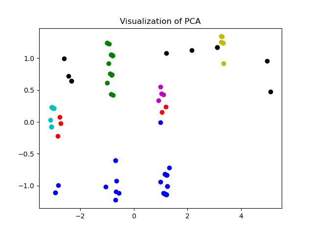
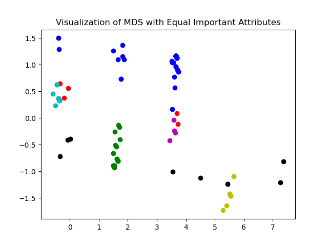
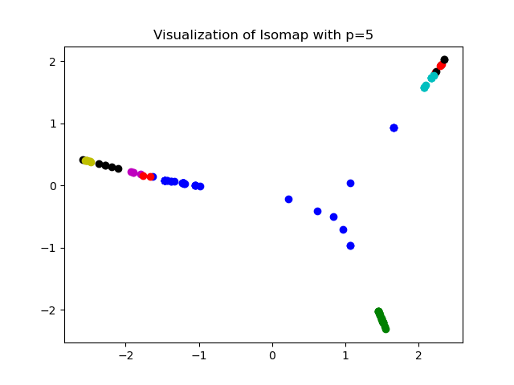

# DD2434-assignment1
This repo is the implementation of Problem 7 of Assignment 1 in course DD2434.

## Dependency
python==3.8.3

numpy==1.18

matplotlib==3.2.2

scipy==1.5.0

## Usage
run `python main.py` in a terminal. 

## Experiment setting
In this repo, I roughly evalute the performance of PCA, MDS and Isomap on the UCI Zoo dataset. For PCA, I directly use the corresponding API in scipy. I implement MDS and Isomap. I experiment with different importance parameters on each feature in MDS and try different number of nearest-neighbor in Isomap. 

For MDS, the importance parameters you could find in importance_parameters.txt.
For Isomap, the number of nearest neighbor in our experiment is set to 5, 6, 7, 8, 9, 10, 15, 20, 30, respectively.

Part of the results are listed below. 

* PCA

  

* MDS

  

* Isomap with the number of nearest-neighbor=5

  